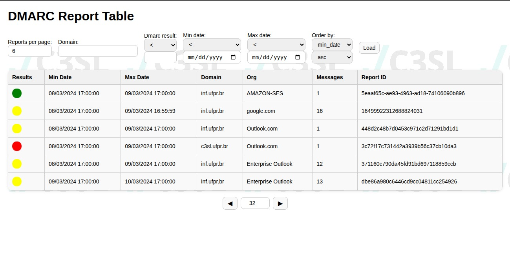

# DMARC REPORT VIEWER
written by Guiusepe Oneda

A webviewer for dmarc reports.



## Quick start
This viewer takes the data stored in an postgres database generated by 
[this](https://github.com/techsneeze/dmarcts-report-parser) repository, which 
can connect to an IMAP server or read a local mailbox file to read and store the 
dmarc reports.

After configuring the database, add a config.json by following the template 
config.example.json. 

Then simply run 
```
npm install
node backend.js
```

And open static/index.html on you browser. You can use Nginx and docker to deploy
this service in a server.

## API

### /reports

Lists the reports.

Argument list:

* sort = {-,}{min,max}date

sorts the values by {max,min}date, add the - sign in the beginning for DESC order.

The default is maxdate DESC

* perPage, page = number

The number of reports by page and the page returned

(page=2, perPage=50) will give the reports 51st to the 100th report.

* {max,min}date={g,l}{e,}@TIMESTAMP

will filter results on mindate and maxdate, could be g (greater), l (lesser), 
ge (Greater or equal), le (lesser or equal). 

* domain=xxxx.yyyy.zzzz

The exact domain to filter

* dmarcResult={g,l}{e,}@NUMBER

Could be l, le, g or ge for the dmarc score (between 0 and 2)

### /reports/details?serial=n

Gives the details for a givens serial id

### /reports/extended

The same as /reports, but each json report's objects will have a "details" field
correspondent to the /details of that report's id. 

Works with every argument as /reports do

### /reports/<serial>.xml

If a valid serial is given, downloads the xml for that report.


